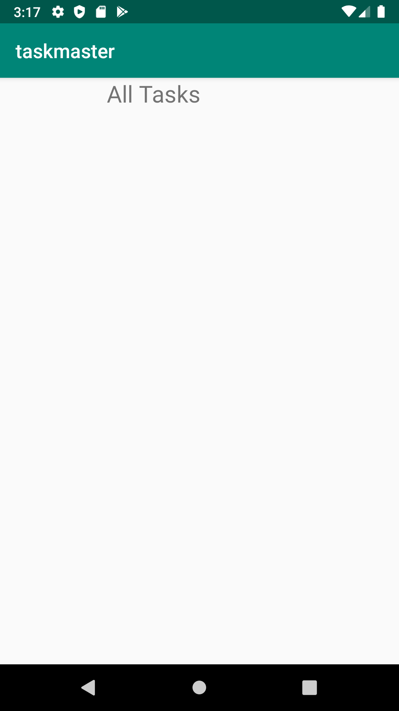

# taskmaster

## Lab26   Beginning TaskMaster

### Home Page

The main page should be built out to match the wireframe. In particular, it should have a heading at the top of the page, an image to mock the “my tasks” view, and buttons at the bottom of the page to allow going to the “add tasks” and “all tasks” page.

### Add Task Page

On the “Add a Task” page, allow users to type in details about a new task, specifically a title and a body. When users click the “submit” button, show a “submitted!” label on the page.

### All Tasks Page

The all tasks page should just be an image with a back button; it needs no functionality.

 
## Lab: 27 - Data in TaskMaster

### Home Page

### Add Task Page

### All Tasks Page

 
## Lab: 36 - Data in TaskMaster
Sign in page

Sign out button works on Main page

